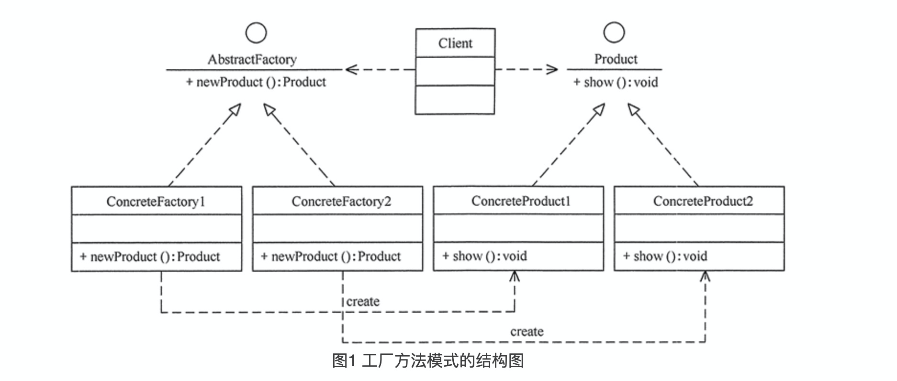

简单工厂模式违背了开闭原则，而“工厂方法模式”是对简单工厂模式的进一步抽象化，其好处是可以使系统在不修改原来代码的情况下引进新的产品，即满足开闭原则。

应用场景：
客户只知道创建产品的工厂名，而不知道具体的产品名。如 TCL 电视工厂、海信电视工厂等。
创建对象的任务由多个具体子工厂中的某一个完成，而抽象工厂只提供创建产品的接口。
客户不关心创建产品的细节，只关心产品的品牌

模式的结构与实现
工厂方法模式由抽象工厂、具体工厂、抽象产品和具体产品等4个要素构成。本节来分析其基本结构和实现方法。

模式的结构
工厂方法模式的主要角色如下。
抽象工厂（Abstract Factory）：提供了创建产品的接口，调用者通过它访问具体工厂的工厂方法 newProduct() 来创建产品。
具体工厂（ConcreteFactory）：主要是实现抽象工厂中的抽象方法，完成具体产品的创建。
抽象产品（Product）：定义了产品的规范，描述了产品的主要特性和功能。
具体产品（ConcreteProduct）：实现了抽象产品角色所定义的接口，由具体工厂来创建，它同具体工厂之间一一对应。

