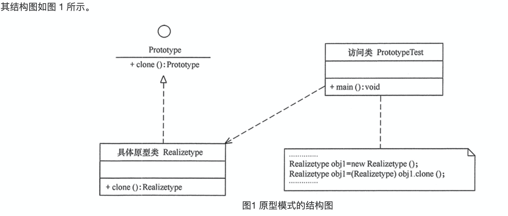

原型（Prototype）模式的定义如下：用一个已经创建的实例作为原型，通过复制该原型对象来创建一个和原型相同或相似的新对象。在这里，原型实例指定了要创建的对象的种类。用这种方式创建对象非常高效，根本无须知道对象创建的细节。例如，Windows 操作系统的安装通常较耗时，如果复制就快了很多。在生活中复制的例子非常多，这里不一一列举了。

 模式的结构 
 原型模式包含以下主要角色。
 1. 抽象原型类：规定了具体原型对象必须实现的接口。
 2. 具体原型类：实现抽象原型类的 clone() 方法，它是可被复制的对象。
 3. 访问类：使用具体原型类中的 clone() 方法来复制新的对象。

    
模式的实现
    
原型模式的克隆分为浅克隆和深克隆。
    
浅克隆：创建一个新对象，新对象的属性和原来对象完全相同，对于非基本类型属性，仍指向原有属性所指向的对象的内存地址。
    
深克隆：创建一个新对象，属性中引用的其他对象也会被克隆，不再指向原有对象地址。  