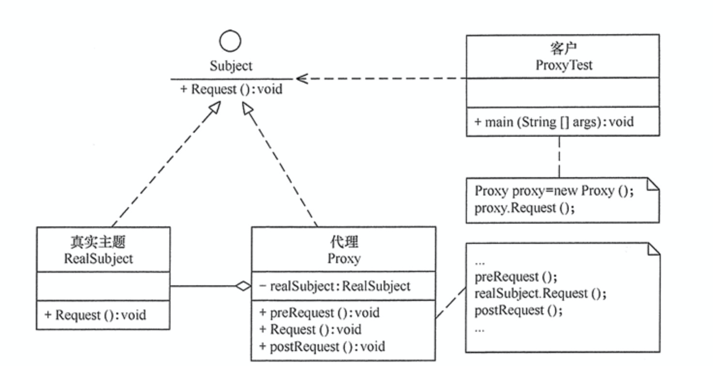

代理模式的定义与特点
代理模式的定义：由于某些原因需要给某对象提供一个代理以控制对该对象的访问。这时，访问对象不适合或者不能直接引用目标对象，代理对象作为访问对象和目标对象之间的中介。

代理模式的主要优点有：
代理模式在客户端与目标对象之间起到一个中介作用和保护目标对象的作用；
代理对象可以扩展目标对象的功能；
代理模式能将客户端与目标对象分离，在一定程度上降低了系统的耦合度，增加了程序的可扩展性

其主要缺点是：
代理模式会造成系统设计中类的数量增加
在客户端和目标对象之间增加一个代理对象，会造成请求处理速度变慢；
增加了系统的复杂度；
那么如何解决以上提到的缺点呢？答案是可以使用动态代理方式

代理模式的结构与实现
代理模式的结构比较简单，主要是通过定义一个继承抽象主题的代理来包含真实主题，从而实现对真实主题的访问，下面来分析其基本结构和实现方法。
1. 模式的结构
代理模式的主要角色如下。
抽象主题（Subject）类：通过接口或抽象类声明真实主题和代理对象实现的业务方法。
真实主题（Real Subject）类：实现了抽象主题中的具体业务，是代理对象所代表的真实对象，是最终要引用的对象。
代理（Proxy）类：提供了与真实主题相同的接口，其内部含有对真实主题的引用，它可以访问、控制或扩展真实主题的功能。
